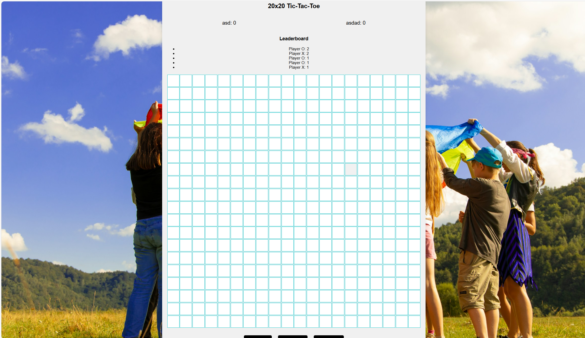

# Tic Tac Toe Game

This project is a web-based implementation of the classic Tic Tac Toe game with a twist: the first player to align five marks in a row wins! The game includes two modes: Human vs. Human and Human vs. AI.

## Assignment 3 - Group 20:

Quang Minh Le - 300165003

David Nguyen - 300232884


## Game Rules

1. **Board**: The game is played on a grid.
2. **Objective**: The first player to get 5 of their marks in a row (horizontally, vertically, or diagonally) wins the game.
3. **Turns**: Players take turns placing their marks (X or O) on the grid.
4. **Modes**: 
    - **Human vs. Human**: Two players play against each other.
    - **Human vs. AI**: A single player competes against an AI opponent.

## Technologies Used

- **HTML**: Structure of the game.
- **CSS**: Styling of the game.
- **JavaScript, PHP(AJAX)**: Game logic and interactivity.

## Installation

To run the game locally, follow these steps:

1. Clone the repository:
    ```bash
    git clone https://github.com/yourusername/tictactoe.git
    ```
2. Navigate to the project directory:
    ```bash
    cd tictactoe
    ```
3. Run <code>php -S localhost:8000</code>

4. Then CRTL + click on the url (http://localhost:8000) in the terminal

## How to Play

1. **Select Mode**: Choose either Human vs. Human or Human vs. AI mode.
2. **Start Game**: Click on an empty cell on the grid to place your mark.
3. **Win the Game**: Be the first to align five marks in a row to win!

## Live Demo

Play the game online: [Tic Tac Toe Game](https://david5x5tictactoe.netlify.app)

## Screenshots of the various user interface states

1. Screenshot of homepage:


2. Screenshot of game page:


